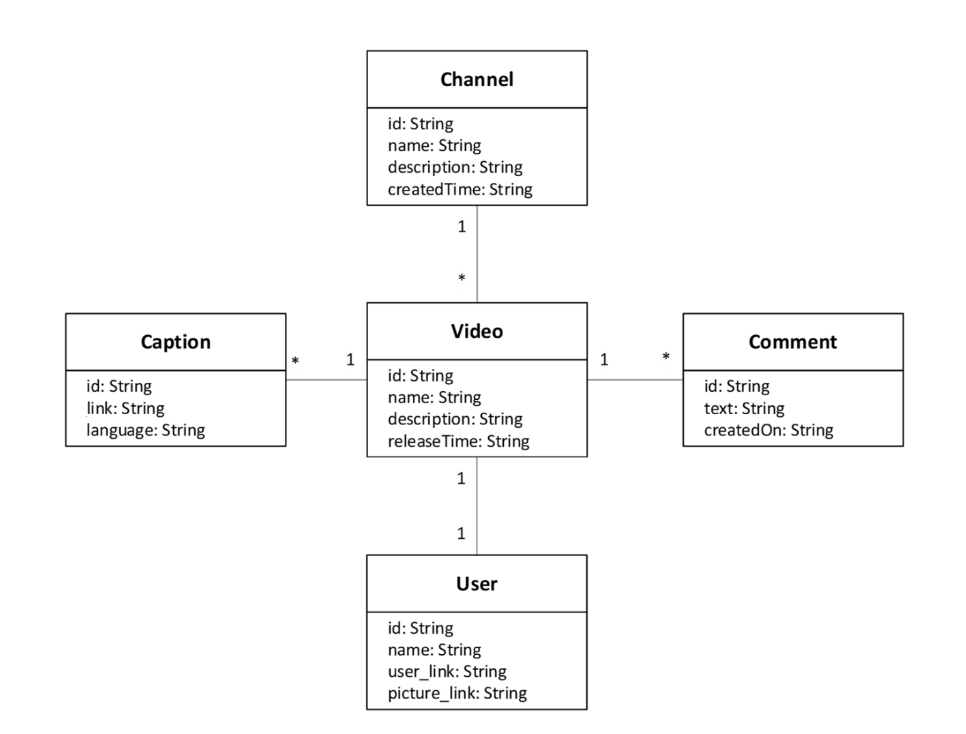

# AISS - Integration project

Deliverable for the AISS subject.

## Index

- [Project information](#project-information)
- [Notes](#notes)
- [TODO list](#todo-list)
- [Git cheatsheet](#git-cheatsheet)

## Project specifications

- Video Miner *(default port: 8080)*
- Peertube Miner *(default port: 8081)*
- Dailymotion Miner *(default port: 8082)*

### Data models

#### Video Miner



## Notes:

- 3rd commit addded the generated *(using https://start.spring.io)* project files for projects `dailymotionminer/` and `peertubeminer/`.
Both of them have been added to the repository, and have "H2 Database" as a dependency in case we want to use it throughout the development of the project. We may remove it in the future if it remains unused.

## TODO list

- [ ] Video Miner
  - [ ] _placeholder_
- [ ] Peertube Miner
  - [ ] _placeholder_
- [ ] Daily motion miner
  - [ ] _placeholder_
     
### Before submitting

- [ ] Clean README.md
  - [ ] Remove Git cheatsheet
- [ ] Consider removing the "H2 Database" dependency of both adapter microservices.

## [Git cheatsheet](https://education.github.com/git-cheat-sheet-education.pdf)

| Command | Effect |
| ------- | ------ |
| `git status` ⭐ | Show useful status info. |
| `git add .` ⭐ | Stage all changes. |
| `git add <file>` | Stage changes made to \<file\>. |
| `git diff` | Show unestaged changes. |
| `git diff --cached` | Show staged changes. |
| `git commit -m "<short descriptive message>"` ⭐ | Commit staged changes. |
| `git push origin main` ⭐ | Push local commits to the main branch. |
| `git pull origin main` ⭐ | Pull changes from remote repo to local repo. |

If you mess anything up: *(hard reset solution)*
1. Backup any changes you want to keep.
2. Execute the following commands:

```bash
git fetch --all
git reset --hard origin/main
```
